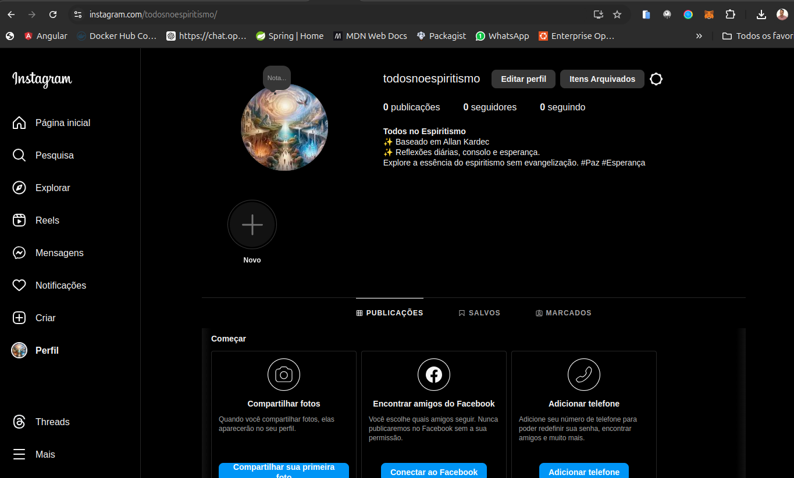
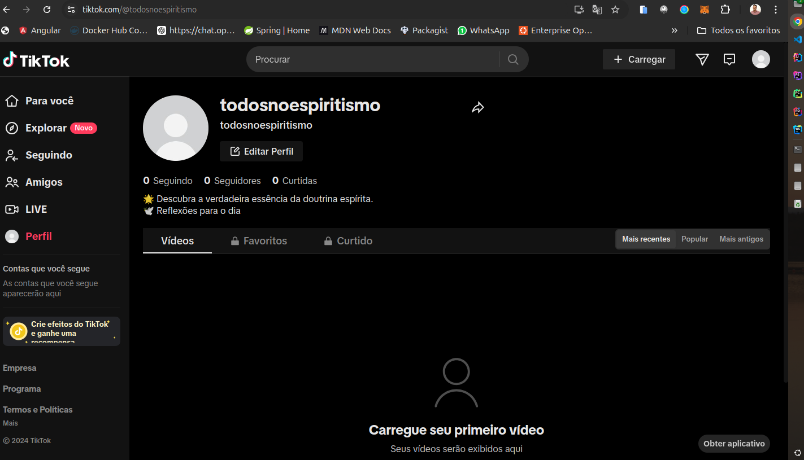

# Desafio DIO - Criação de um DAO

#### Nomeação da DAO:
 Todos no Espiritismo

#### Missão e Visão

~~~
    Criar uma comunidade acolhedora e colaborativa, fundamentada nos ensinamentos de Alln Kardec, que oferece conforto, consolo e esclarecimentos espiritual a todos os seus membraos. Através da transparência, descentralização e participaração democrática, buscamos promover a essência do espiritismo de forma inclusiva e acessível, sem o intuito de envelizar, mas com o própósito de proporcionar bem-estar emocional e espiritual.
    
    - <h4>Principais Objetivos da Nossa Missão:</h4>
    Proporcionar Conforto e Consolo: Compartilhar mensagens e reflexões baseadas na doutrina espírita que tragam paz e esperança para os membros.
    Fomentar a Participação Democrática: Permitir que todos os membros tenham voz ativa nas decisões da DAO, criando um ambiente onde cada opinião é valorizdada e respeitada.
    Garantir Transparência e Descentralização: Utilizar a tecnolocia blockchain para assegurar que todas as ações e decisões sejam registradas de forma transpaarente e acessível a todos.
    Promover o Esclarecimento Espiritual: Divulgar os princípios do espirismo de maneira clara e objetiva, ajudando os membros a entenderem e aplicar esses conhecimentos em suas vidas diárias.
    Construir uma Comunidade Inclusiva: Criar um espaço onde todos são bem-vindos, independentemente de suas crenças pessoais, e onde o foco está no bem estar coletivo e no apoio mútuo.
    Valores Fundamentais:
    Empatia e Compaixão:: Tratar todos com respeito e compreensão, oferecendo apoio emocional e espiritual de maneira carinhosa.
    Integridade e Honestidade: Manter a transparência em todas as nossas ações e comunicações, garantindo a confiança e a credibilidade da nossa comunidade.
    Colaboração e União: Trabalhar juntos para alcançar objetivos comuns, valorizando a contribuição de cada membro e promovendo o espírito de cooperação.
    Educação e Esclarecimento: Incentivar o aprendizado contínuo e a disseminação do conhecimento espírita de forma acessível e compreensível para todos.

#### Entrga da DAO todos no Espiritismo

~~~
    1. Introdução
    A "Todos no Espiritismo" é uma Organização Autônoma Descentralizada (DAO) baseada na doutrina espírita de Allan Kardec. Nosso objetivo principal é proporcionar um espaço colaborativo onde membros possam participar de decisões, criar propostas e votar em iniciativas que tragam conforto e consolo através dos ensinamentos espíritas, sem o objetivo de evangelizar.

    2. Objetivos
    Prover Conforto e Consolo: Compartilhar reflexões, mensagens de paz e esperança baseadas na doutrina espírita.
    Promover Colaboração: Permitir que membros proponham e votem em iniciativas que beneficiem a comunidade.
    Descentralização e Transparência: Operar de maneira descentralizada, garantindo que todas as decisões sejam transparentes e democráticas.
    3. Funcionalidades
    3.1 Gestão de Membros
    Adição de Membros: Qualquer membro pode adicionar novos membros à DAO.
    Verificação de Membros: Função para verificar se um endereço é membro.
    3.2 Criação de Propostas
    Nova Proposta: Membros podem criar novas propostas descrevendo iniciativas ou mudanças desejadas.
    Lista de Propostas: Armazena todas as propostas criadas.
    3.3 Votação
    Votação em Propostas: Membros podem votar nas propostas criadas.
    Contagem de Votos: A proposta deve obter a maioria dos votos dos membros para ser executada.
    3.4 Execução de Propostas
    Execução: Propostas aprovadas são executadas de acordo com a lógica definida, proporcionando transparência e responsabilidade.
    4. Benefícios
    Participação Democrática: Todos os membros têm voz nas decisões da DAO.
    Transparência: Todas as ações e decisões são registradas na blockchain, garantindo total transparência.
    Comunitarismo: Incentiva a criação de uma comunidade unida pelos princípios espíritas.
    5. Estrutura do Smart Contract
    5.1 Contrato Principal
    O contrato inteligente foi desenvolvido em Solidity e inclui as seguintes estruturas e funções:

    5.1.1 Estrutura Proposal
    solidity
    Copiar código
    struct Proposal {
        uint id;
        string description;
        uint voteCount;
        bool executed;
    }
    5.1.2 Funções
    addMember(address _member): Adiciona um novo membro.
    createProposal(string memory _description): Cria uma nova proposta.
    vote(uint _proposalId): Vota em uma proposta.
    executeProposal(uint _proposalId): Executa uma proposta.
    getProposalsCount(): Retorna o número total de propostas.
    isMember(address _address): Verifica se um endereço é membro.
    6. Conclusão
    A DAO "Todos no Espiritismo" visa criar uma plataforma colaborativa baseada na doutrina de Allan Kardec, proporcionando conforto, consolo e a oportunidade de participação ativa dos membros nas decisões da comunidade. Através da transparência e descentralização oferecidas pela blockchain, buscamos construir uma comunidade unida e fortalecida pelos princípios espíritas.

    Exemplo de Smart Contract

    // SPDX-License-Identifier: MIT
            pragma solidity ^0.8.0;
            contract TodosNoEspiritismoDAO {
                // Estrutura de dados para uma proposta
                struct Prosal {
                    uind id;
                    string description;
                    uint voteCount;
                    bool executed;
                }
                // Lista de prppostas
                Proposa[] public proposals;
                //Mapeamento de endereços de membros
                mapping(address => bool) public members;
                uint public memberCount;
                // Mapeamento de endereços de membros
                mapping(address => bool) public members;
                uint public membersCount;

                // Evento para a criação de uma nova proposta
                event ProposalCreated(uint id, string description);
                // Evento para a votação em uma proposta
                event Voted(uint proposalId, address voter);
                // Evento para a execução de uma proposta
                event ProposalExecuted(uint proposalId);

                // Modificador para verificar se o remetente é um membro
                modifier onlyMember() {
                    require(members[msg.sender], "Apenas membros podem executar essa ação.");
                    _;
                }

                // Construtor para adicionar o criador do contrato como membro inicial
                constructor() {
                    members[msg.sender] = true;
                    membersCount++;
                }

                // Função para adicionar um novo membro
                function addMember(address _member) public onlyMember {
                    require(!members[_member], "Este endereço já é um membro.");
                    members[_member] = true;
                    membersCount++;
                }

                // Função para criar uma nova proposta
                function createProposal(string memory _description) public onlyMember {
                    proposals.push(Proposal({
                        id: proposals.length,
                        description: _description,
                        voteCount: 0,
                        executed: false
                    }));
                    emit ProposalCreated(proposals.length - 1, _description);
                }

                // Função para votar em uma proposta
                function vote(uint _proposalId) public onlyMember {
                    require(_proposalId < proposals.length, "Proposta inválida.");
                    Proposal storage proposal = proposals[_proposalId];
                    proposal.voteCount++;
                    emit Voted(_proposalId, msg.sender);
                }

                // Função para executar uma proposta
                function executeProposal(uint _proposalId) public onlyMember {
                    require(_proposalId < proposals.length, "Proposta inválida.");
                    Proposal storage proposal = proposals[_proposalId];
                    require(proposal.voteCount > membersCount / 2, "A proposta precisa de maioria dos votos.");
                    require(!proposal.executed, "A proposta já foi executada.");
                    proposal.executed = true;
                    // Aqui você pode adicionar lógica para o que acontece quando a proposta é executada
                    emit ProposalExecuted(_proposalId);
                }

                // Função para obter a quantidade de propostas
                function getProposalsCount() public view returns (uint) {
                    return proposals.length;
                }

                // Função para verificar se um endereço é membro
                function isMember(address _address) public view returns (bool) {
                    return members[_address];
                }  
            }
~~~

#### Redes Sociais

Atualmente a nossa DAO conta dom duas redes sociais Instagram 
e TicToc .

#### Token de Governança

~~~

    Lancar um token de governança paa uma DAO envolve várias etaps que incluem a criação de um contrato inteligente(smart contract) para o token, a distrinuição inicial dos tokens e a integração desses tokens com o ssitema de governança da DAO.
    <h4>1. Definição do token de Governança</h4>
        Antes de começar a codificar, precisamos definir as especificações do token:
        - Nome do Token: Todos o Espiristimo Token
        - Simbolo do Token: TNE
        - Total Supply: 20,000,000,000.00
        - Decimal Places: 18 casa
        - Distribuição Inicial: Innicialmente os Tokens serão reservas, para futuras doaçoes para a DAO.
    <h4>Codificação do Token de Governança</h4>
        O token será criado como um contrato inteligente em Solidity, geralmente seguindo o padrão ERC-20, que é amplamente utilizado para tokens fingíveis na blockchain Ethereum.
        ~~~
            // SPDX-License-Identifier: MIT
            pragma solidity ^0.8.0;

            import "@openzeppelin/contracts/token/ERC20/ERC20.sol";
            import "@openzeppelin/contracts/access/Ownable.sol";

            contract TodosNoEspiritismoToken is ERC20, Ownable {
                constructor(uint256 initialSupply) ERC20("TodosNoEspiritismo Token", "TNE") {
                    _mint(msg.sender, initialSupply);
                }

                // Função para que o proprietário da DAO possa criar novos tokens, se necessário
                function mint(address to, uint256 amount) public onlyOwner {
                    _mint(to, amount);
                }
            }
        ~~~
    <h4>Deploy do Contrato na Blockchain</h4>
        Depois de codificar o contrato inteligente, é preciso fazer o deploy dele em uma rede blockchain.
    <h4>Distribuição dos Tokens</h4>
        Após o deploy do contrato, você precisará deistribuir os tokens para os membros iniciais da DAO ou conforme plano de distribuição
        Exemplo de transfer:
        ~~~
            function transfer(address recipient, uint256 amount) public returns (bool);
        ~~~
    <h4>Integração com a governança</h4>
        Os tokens estão criados e distribuídos, devemos integrar o uso deles com o sitema de governaça da DAO. Isso pode ser feito permitindo que os membros usem o tokens para votar em propostas, onde cada token correspoe a um voto. Com o contrto já cria, podemos modificar esse contrato para contabilizar os votos com base na quantidade de tokens.
        ~~~
            function vote(uint _proposalId, uint256 tokenAmount) public onlyMember {
            require(_proposalId < proposals.length, "Proposta inválida.");
            require(balanceOf(msg.sender) >= tokenAmount, "Tokens insuficientes.");
            
            Proposal storage proposal = proposals[_proposalId];
            proposal.voteCount += tokenAmount;
            _burn(msg.sender, tokenAmount); // Opcional: queimar tokens após voto

            emit Voted(_proposalId, msg.sender);
        ~~~
~~~

#### Criando um mecanismo de Financiamento
~~~
    Criar um mecamisno de financiamento de uma DAO pra captar recursos para uma DAO envolve desenvolver uma estatrégia clara para arrecadas fundos, implementar contratos inteligentes que suportem a captação de recursos e definir como esses fundos serão geridos
    <h4>Definir os Objetivos de Financiamentos</h4>
        Antes de implementar, precisamos definir claramente os objetivos de financiamento da DAO:
        - Meta de Arrecadação: Quanto capital precisa para ser arrecadado, no caso da DAO - zero.
        - Uso dos fundos: Os fundos arrecados com as compras do token serão utilizados para a caridade em centros de infatios e asilos.
        - Período de Financiamento: não terá período definido, será constante até que todos os tokens seja comprados.
    <h4>Escolher o modelo de financiamentos</h4>
        - Venda de Tokens (ICO/IDO): Esse é o caso de nossa DAO, que emite tokens que serão vendidos e investidos em ajuda.
        Crowdfunding: A DAO arrecada fundos diretamente do público em troca de benefícios, como participação futura em lucros ou tokens.
        Equity Tokens: Se apropriado, os investidores recebem tokens que representam uma participação no sucesso econômico da DAO.
        Staking e Yield Farming: Os participantes depositam (stake) seus tokens em troca de recompensas, que podem ser tokens da DAO ou outros ativos.
    <h4>Desenvolvor o Contrato Inteligente de Financiamento</h4>
        Como o modelo de financiamento escolhido, deverá ser desenvolvido o contrato inteligente que gerenciará a captaçã de recursos.Temos o smart contract para a vendas de tokens
        ~~~
        // SPDX-License-Identifier: MIT
        pragma solidity ^0.8.0;

        import "@openzeppelin/contracts/token/ERC20/ERC20.sol";
        import "@openzeppelin/contracts/access/Ownable.sol";

        contract ICO is Ownable {
            ERC20 public token;
            uint256 public rate;
            uint256 public start;
            uint256 public end;

            constructor(address tokenAddress, uint256 _rate, uint256 _start, uint256 _end) {
                token = ERC20(tokenAddress);
                rate = _rate; // Exemplo: 1 ETH = 100 tokens
                start = _start;
                end = _end;
            }

            modifier icoActive() {
                require(block.timestamp >= start && block.timestamp <= end, "ICO não está ativa");
                _;
            }

            function buyTokens() public payable icoActive {
                uint256 tokenAmount = msg.value * rate;
                require(token.balanceOf(address(this)) >= tokenAmount, "Tokens insuficientes no contrato");
                token.transfer(msg.sender, tokenAmount);
            }

            function withdrawFunds() public onlyOwner {
                payable(owner()).transfer(address(this).balance);
            }

            function endICO() public onlyOwner {
                require(block.timestamp > end, "ICO ainda não terminou");
                uint256 unsoldTokens = token.balanceOf(address(this));
                token.transfer(owner(), unsoldTokens);
            }
        }
        ~~~
    <h4>Fazer o deploy do Contrato</h4>
        Após escrever o contrato inteligente, devemos realizar o deploy na blockchain desejada. Usando ferramentas como o REMIX, Hardhat ou Truffle.
    <h4>Configurar e lançar a campanha</h4>
        - Preparação: Anuncie o lançamento do financiamento, fornecendo inforamções claras sobre como os funcos serão utilizados, benifícios para os invesrtidores e qualquer riscos envolvidos.
        - Lançamento: Inicie a campanha de arrecadação, garantindo que os investidores possam facilmente participar
    <h4>Gerenciamento dos Fundos Arrecadados</h4>
        - Retirado dos fundos: use a função saque no contrato inteligente para transferir os fundos arrecadados para o endereço da DAO.
        - Trasnparência: publique relatórios como os fundos serão utilizados para garantir a confiança da comunidade.
    <h4>Manutenção e Atualização</h4>
        Monitoramento do processo de financiamento e, se necessário, fazer ajuste ou atualizações no contrato inteligente para refletir novas necessidades ou correções.
    <h4>Distribuição da recompensas</h4>
        Se o modelo escolhido incluir recompensar ou benefícios futuros, assegurar de que estas sejam distribuídas conforme prometido aos investidores.
~~~
#### Criar uma LLC (Limited Liability Company)
~~~
    É um processo que envolver a escolha de uma estrutura legal e o cumprimento de várias etapas administrativas e legais. 
    <h4>Estado para o registro da LLC</h4>
        Pode formar uma LLC em qualquer estado dos EUA. Algumas empresas optam por formar LLC em estados como Delaware ou Nevada devido às suas leis empresariais favoráveis, mas podemos registrar no estado onde pretende operar.
    <h4>Escolha o Nome da LLC</h4>
        O ome da nossa LLC é Todos no Espiritismo LLC. Pois dependendo do estado deve-seinclir o "LLC" ou  "Limited Liability Company"
        - Verifique a Disponibilidade do Nome: Use a base de dados do estado para garantir que o nome escolhido está disponível.
        - Registro de Nome de Domínio: Verifique se o nome de domínio correspondente está disponível, caso pretenda criar um site.
    <h4>Designar um Agente Registrado</h4>
        Um agente registrado é a pessoa ou empresa responsável por receber documentos legais em nome da LLC. O agente registrado deve ter um endereço físico no estado onde a LLC está registrada.

    <h4>Preencha o Certificado de Constituição (Articles of Organization)</h4>
        O próximo passo é preencher e enviar o documento chamado "Articles of Organization" (ou Certificado de Constituição) ao estado. Este documento inclui:

        Nome da LLC.
        Endereço principal da LLC.
        Nome e endereço do agente registrado.
        Informações sobre os membros da LLC (opcional em alguns estados).
        5. Crie um Acordo Operacional (Operating Agreement)
        Embora não seja obrigatório em todos os estados, um Acordo Operacional é altamente recomendado. Este documento define as regras de operação da LLC e as responsabilidades dos membros.
        Propriedade da LLC: Especifique quem são os membros e qual é a participação de cada um.
        Distribuição de Lucros e Perdas: Detalhe como os lucros e perdas serão distribuídos entre os membros.
        Processo de Votação e Tomada de Decisões: Descreva como as decisões serão tomadas e quem tem direito a voto.
        Procedimentos de Adição e Saída de Membros: Explique como novos membros podem ser adicionados ou como um membro pode sair da LLC.
    <h4>>Obtenha um Número de Identificação do Empregador (EIN)</h4>
        O EIN (Employer Identification Number) é emitido pelo IRS (Internal Revenue Service) e funciona como um número de identificação fiscal para a LLC. Você precisará de um EIN para abrir uma conta bancária empresarial e para fins fiscais.
        Solicitar Online: Você pode solicitar um EIN online através do site do IRS.
    <h4>Registro e Licenciamento de Negócios</h4>
        Dependendo do estado e da natureza da sua empresa, pode ser necessário registrar a LLC para fins fiscais e obter licenças e autorizações locais, estaduais ou federais.
        Registro de Impostos Estaduais: Registre-se no departamento de receita do estado para pagar impostos de vendas, retenções de funcionários, etc.
        Licenças Específicas do Setor: Verifique se há licenças específicas necessárias para operar legalmente no seu setor.
    <h4>Abrir uma Conta Bancária Empresarial</h4>
        Abra uma conta bancária para separar as finanças da empresa das finanças pessoais. Isso ajuda a manter a proteção de responsabilidade limitada.
    <h4>Manter Conformidade Anual</h4>
        Mantenha-se em conformidade com os requisitos estaduais e federais, como arquivar relatórios anuais e pagar taxas de renovação.
        Relatórios Anuais: Muitos estados exigem que as LLCs arquivem relatórios anuais ou bienais e paguem uma taxa.
        Manter Registros Contábeis: Mantenha registros financeiros precisos e atualizados.
    <h4>Considerar Contratar Profissionais</h4>
        Considerar contratar advogados ou contadores para ajudar na criação e manutenção da LLC pode ser uma boa ideia, especialmente se a estrutura for complexa.
~~~